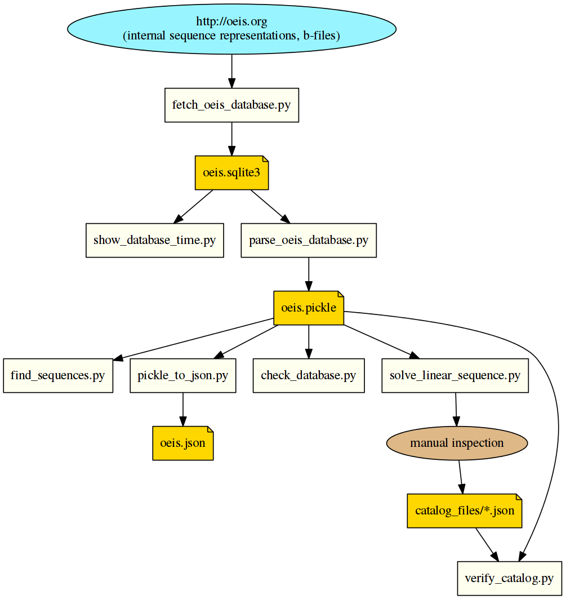

OEIS Tools
==========

This repository contains scripts to download, process, and analyze data from the
Online Encyclopedia of Integer Sequences (OEIS), as hosted on http://www.oeis.org.

Overview
--------

These tools can handle OEIS data from three types of sources:

1. **remote**: the OEIS database residing on the oeis.org server.
   The remote database can be accessed via HTTP or HTTPS requests.
2. **local sqlite3**: a replica of the remote database as a local SQLite3 database file.
3. **local pickle**: the OEIS database a a local pickle-format file, used for local analysis.
   The "pickle" format is Python-specific.

The local sqlite3 database is obtained from the remote database
by an automatic web-crawler called `fetch_oeis_database.py`.
It contains the sequence metadata in the internal format as it is used on the remote side,
as well as so called 'b-file' data that contain sequence data *a(n)* up to high values of *n*.

The local pickle format database is obtained from the `local_sqlite3` database by parsing the data
and turning it into `OeisEntry` instances.
The pickled list of all OeisEntry instances can be read in its entirety within a few seconds.

Apart from these sources that describe the OEIS data, we also use the "catalog",
which is a Python module that contains implementations of sequence generating functions.

Dependencies
------------

- All code is written in [Python 3](https://en.wikipedia.org/wiki/History_of_Python#Version_3).
- Some code depends on the [numpy](http://www.numpy.org/) library:
  - `show_database_time.py`
  - `solve_linear_sequence.py`
- Some code depends on the [matplotlib](https://matplotlib.org/) library:
  - `show_database_time.py`

Description of files
--------------------

### Non-Python files

filename                            |  description
------------------------------------|------------------------------------------------------------------------------------
`README.md`                         |  Text file (markdown format) description of the project.
`catalog_files/*.json`              |  Catalog files, describing parametrized sequence generating functions.

### Python script files

filename                            |  description
------------------------------------|------------------------------------------------------------------------------------
`fetch_oeis_database.py`            |  Fetch and refresh data from the remote OEIS database to a local sqlite3 database.
`show_database_time.py`             |  Visualize time stamps in a given local sqlite3 OEIS database.
`parse_oeis_database.py`            |  Parse a local sqlite3 database and produce a local pickle database.
`find_sequences.py`                 |  Probe a local pickle database for a given sequence (work in progress).
`pickle_to_json.py`                 |  Read a local pickle database and write a JSON version.
`solve_linear_sequence.py`          |  Find linear sequences in a local 'pickle' database.
`check_database.py`                 |  Perform a number of checks on the data in a local pickle database.
`verify_oeis_catalog.py`            |  Verify the catalog.

### Python modules

filename                            |  description
------------------------------------|------------------------------------------------------------------------------------
`fraction_based_linear_algebra.py`  |  Perform matrix inversion without loss of precision using the Fraction type.
`charmap.py`                        |  Defines lists of acceptable characters for the OEIS directives.
`OeisEntry.py`                      |  Defines a simple class that contains (most of) the data of a single OEIS sequence.
`timer.py`                          |  Simplifies timing lengthy operations using a context manager.
`fetch_remote_oeis_entry.py`        |  Fetches a single sequence's data from the OEIS website (www.oeis.org).
`catalog.py`                        |  Access the local catalog.

How it all fits together
------------------------

